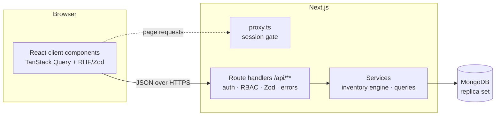

# StockSense

**A modular, real-time Inventory Management System.** StockSense replaces manual registers and spreadsheets with one ledger for receipts, deliveries, internal transfers and stock adjustments, across multiple warehouses and locations.

Built for the **Odoo x GCET Hyderabad Hackathon 2026** (virtual round).

---

## Features

| Area | What you get |
|---|---|
| **Authentication** | Sign up / log in with Login ID or email, **OTP-based password reset** (6-digit code, 10 min expiry, 5 attempts, resend cooldown), signed httpOnly session cookie, redirect to the dashboard |
| **Roles** | *Inventory Manager* plans receipts and deliveries and manages master data. *Warehouse Staff* picks, packs, validates, transfers and counts. Enforced by the API and mirrored in the UI |
| **Dashboard** | KPIs: products in stock, low / out of stock, pending receipts, pending deliveries, scheduled transfers. Receipt / delivery / transfer cards (to process, late, waiting, upcoming). **Dynamic filters** by document type, status, warehouse, location and category. Low stock alerts and recent moves. Live refresh |
| **Products** | Create / update products (name, SKU, category, unit of measure, cost, optional initial stock), stock per location, categories, **reordering rules** (min / max) with one-click replenishment |
| **Receipts** | Supplier, destination, products and quantities: Draft → To Do → Ready → **Validate: stock increases** |
| **Delivery orders** | Stock is reserved on To Do (or **Waiting** when short, with the line marked red). **Pick → Pack → Validate: stock decreases**. Waiting orders become Ready automatically when stock arrives |
| **Internal transfers** | Between racks, floors or warehouses (e.g. Main Store → Production Rack). Total stock unchanged, location updated |
| **Inventory adjustments** | Pick a location, enter counted quantities, and the system applies and logs the difference. Quick "Update stock" from the Stock page |
| **Move history & ledger** | Every move with from → to, incoming in green, outgoing in red. List and kanban views, search by reference, contact or product. Per-product ledger with running balance |
| **Also** | References like `WH/IN/0001`, printable documents, multi-warehouse, global SKU search (Ctrl K), low stock alerts, light / dark theme, responsive layout |

The simplified flow from the problem statement is included in the demo data: receive 100 kg steel (+100), move 40 kg to the production rack (total unchanged), deliver 20 kg (−20), adjust 3 kg damaged (−3), for 77 kg in stock, all visible in the steel ledger.

## Tech stack

| Layer | Choice |
|---|---|
| Framework | **Next.js 16** (App Router, React 19, TypeScript strict): one monolith for UI and REST API |
| Database | **MongoDB** with Mongoose. Multi-document **transactions** keep stock and operations consistent |
| Validation | **Zod**, shared by client forms (React Hook Form) and API handlers |
| Auth | bcrypt password hashing, JWT (jose, HS256) in an httpOnly cookie, HMAC-hashed OTP codes, Nodemailer for mail |
| UI | Tailwind CSS 4, shadcn/ui (Radix primitives), lucide icons, sonner toasts, next-themes |
| Data fetching | TanStack Query with live polling and cache invalidation after every mutation |

## Architecture



- `src/app/api/**` holds thin REST handlers. `route()` connects to the database, resolves the user, checks the capability, validates with Zod and maps errors to HTTP status codes.
- `src/server/services/inventory.ts` is the **stock engine**, the only code that changes quantities. Every action runs in a transaction; quants are updated with guards (no negative stock, reserved ≤ on hand).
- `src/lib` holds code shared by client and server: constants, permission matrix, Zod schemas, types, formatting.

### Data model

| Collection | Purpose |
|---|---|
| `users` | Login ID, email, bcrypt hash, role, active flag, session version (invalidates sessions after a password change) |
| `otptokens` | Hashed reset codes with TTL expiry and attempt counter |
| `warehouses` / `locations` | Warehouses with internal locations (`WH/Stock`, `WH/RackA`). Virtual *Vendors*, *Customers* and *Inventory Adjustment* locations make every move a from → to pair |
| `categories` / `products` | Catalog (unique SKU, unit of measure, cost per unit) |
| `reorderrules` | Min / max per product and warehouse, which drives low stock alerts |
| `stockquants` | Quantity and reserved quantity per product and location (free to use = on hand − reserved) |
| `operations` | Receipts, deliveries, transfers and adjustments with embedded product lines. Done operations are immutable and form the ledger |
| `counters` | Atomic sequences for references `<WAREHOUSE>/<IN\|OUT\|INT\|ADJ>/<0001>` |

### Operation lifecycle

| Type | Move | Flow |
|---|---|---|
| Receipt | Vendors → internal | Draft → **To Do** → Ready → **Validate** → Done (+qty) |
| Delivery | internal → Customers | Draft → **To Do** → Ready (reserved) or Waiting → Pick → Pack → **Validate** → Done (−qty) |
| Internal transfer | internal → internal | Draft → **To Do** → Ready or Waiting → **Validate** → Done |
| Adjustment | internal ↔ Inventory Adjustment | Draft → **Validate** → Done (on hand := counted, difference logged) |

Open operations can be cancelled (reservations released) or reset to draft. "Late" means the scheduled date is before today, compared using the user's local date.

## REST API

All endpoints return `{ data }` or `{ error: { code, message, fields } }`.

| Method | Endpoint | Description |
|---|---|---|
| POST | `/api/auth/signup`, `/api/auth/login`, `/api/auth/logout` | Session management |
| POST | `/api/auth/forgot-password`, `/api/auth/reset-password` | OTP password reset |
| GET/PATCH | `/api/profile`, POST `/api/profile/password` | My profile |
| GET, PATCH | `/api/users`, `/api/users/:id` | Users and roles (manager) |
| GET, POST, PATCH, DELETE | `/api/warehouses`, `/api/locations`, `/api/categories`, `/api/reorder-rules` | Master data |
| GET, POST, PATCH, DELETE | `/api/products`, `/api/products/:id`, GET `/api/products/:id/ledger` | Products, stock and ledger |
| GET | `/api/stock`, `/api/stock/availability` | Stock per product / location |
| POST | `/api/stock/adjust` | Quick stock count (booked as an adjustment) |
| GET, POST | `/api/operations` | List (filters: type, status, warehouse, location, category, q, late) / create |
| GET, PATCH, DELETE | `/api/operations/:id` | Read / edit / delete draft |
| POST | `/api/operations/:id/{confirm, check-availability, pick, pack, validate, cancel, reset}` | State transitions |
| GET | `/api/moves`, `/api/dashboard`, `/api/alerts`, `/api/search` | Move history, KPIs, alerts, global search |

## Getting started

Requirements: Node.js 20.9+ and a MongoDB replica set (MongoDB Atlas free tier, or Docker for a fully local setup).

```bash
git clone https://github.com/hanvithSai/StockSense.git
cd StockSense
npm install
cp .env.example .env.local        # set MONGODB_URI and AUTH_SECRET
docker compose up -d              # optional: local MongoDB replica set (offline)
npm run seed                      # optional: demo data (use -- --reset to wipe first)
npm run dev                       # http://localhost:3000
```

Demo accounts created by the seed:

| Role | Login ID | Password |
|---|---|---|
| Inventory Manager | `manager` | `Manager@123` |
| Warehouse Staff | `warehouse` | `Staff@1234` |

Without the seed, the first account that signs up becomes the Inventory Manager; later sign-ups join as Warehouse Staff.

### Scripts

| Script | Purpose |
|---|---|
| `npm run dev` | Development server |
| `npm run build` / `npm start` | Production build / server |
| `npm run lint` / `npm run typecheck` | ESLint / TypeScript checks |
| `npm run seed` | Demo data, replayed through the real stock engine |

### Deployment

The app deploys to **Vercel** without extra configuration: import the repository, set `MONGODB_URI`, `AUTH_SECRET` and, optionally, the SMTP variables from `.env.example`.

## Project structure

```
src/
  app/
    (auth)/            login, signup, forgot password (OTP)
    (app)/             dashboard, operations, products, stock, move history, settings, profile
    api/               REST route handlers
    print/             printable documents
  components/          layout shell, shared UI, feature components, shadcn/ui primitives
  hooks/               data and UI hooks
  lib/                 constants, permissions, Zod schemas, types, formatting (shared)
  server/              database, models, auth, services (inventory engine, queries)
  proxy.ts             session gate for pages
scripts/seed.ts        demo data
```
