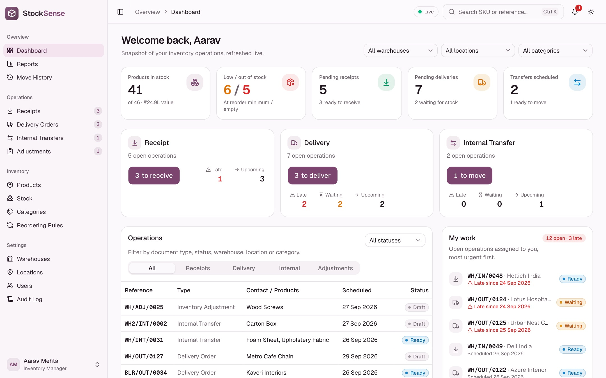
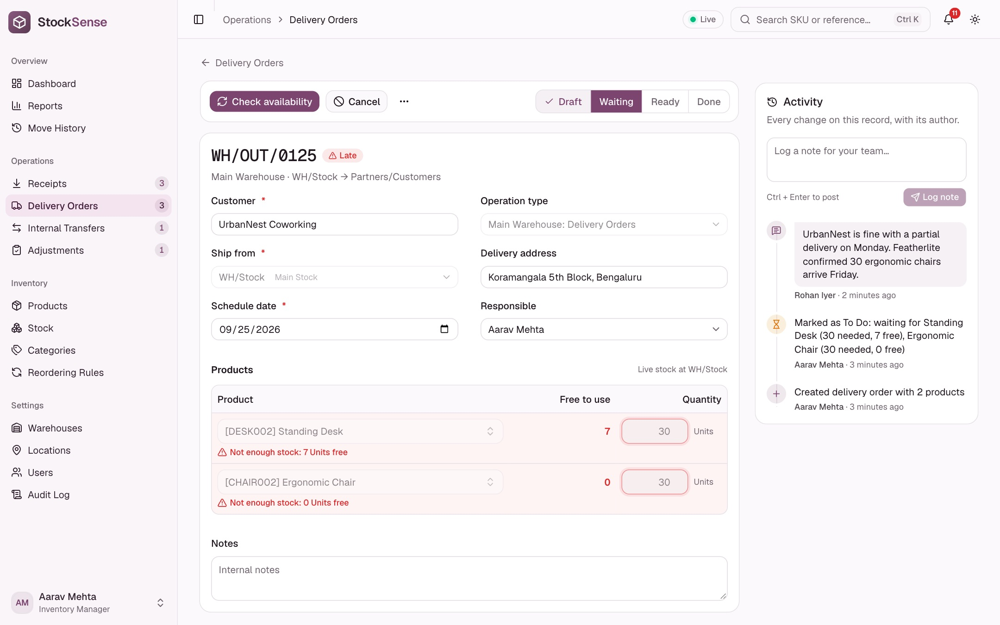
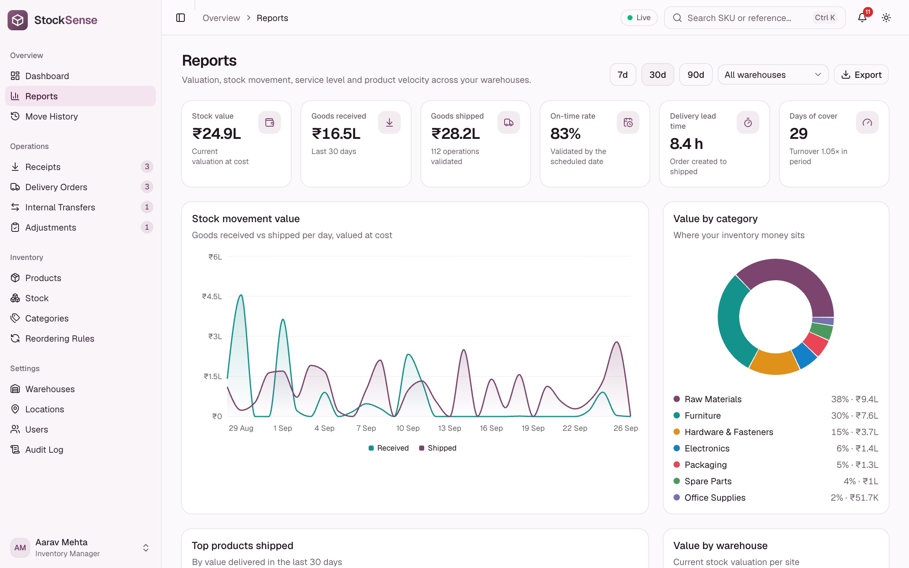
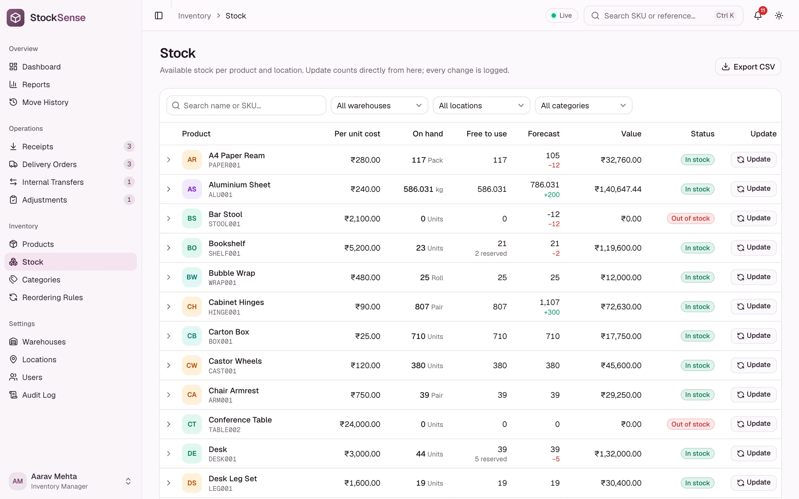
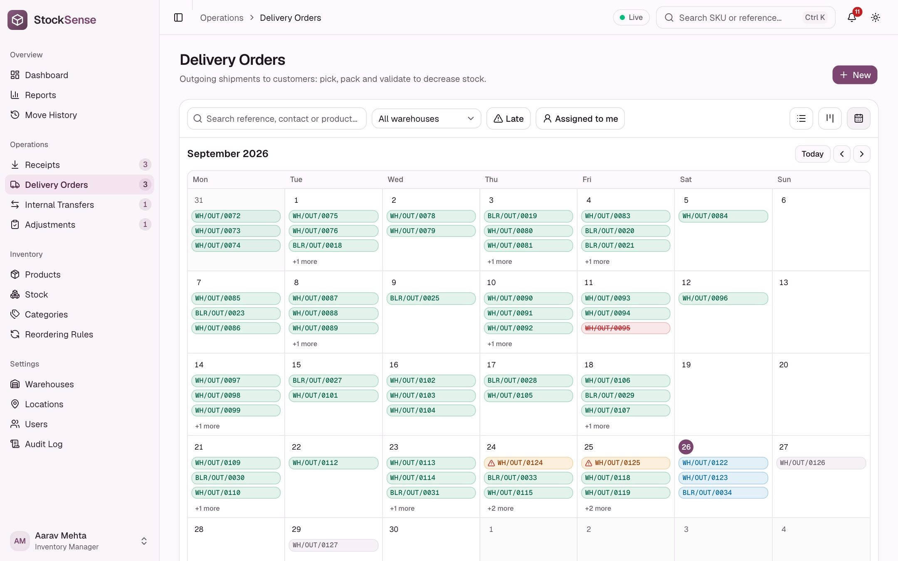
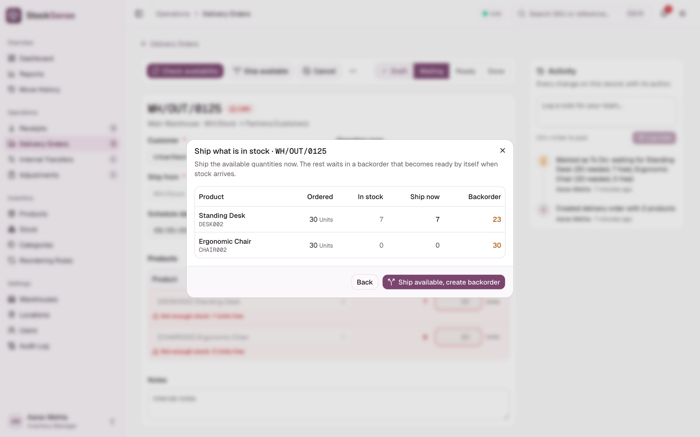
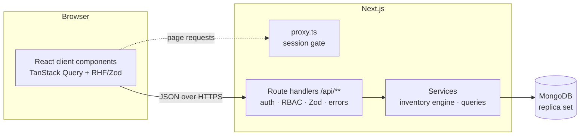

# StockSense

**A modular, real-time Inventory Management System.** StockSense replaces manual registers and spreadsheets with one ledger for receipts, deliveries, internal transfers and stock adjustments, across multiple warehouses and locations.

Built for the **Odoo x GCET Hyderabad Hackathon 2026** (virtual round).

---

## Features

| Area | What you get |
|---|---|
| **Authentication** | Sign up / log in with Login ID or email, **OTP-based password reset** (6-digit code, 10 min expiry, 5 attempts, resend cooldown), signed httpOnly session cookie, redirect to the dashboard |
| **Roles** | *Inventory Manager* plans receipts and deliveries and manages master data and users (including creating accounts with a temporary password). *Warehouse Staff* picks, packs, validates, transfers and counts. Enforced by the API and mirrored in the UI |
| **Dashboard** | KPIs: products in stock, low / out of stock, pending receipts, pending deliveries, scheduled transfers. Receipt / delivery / transfer cards (to process, late, waiting, upcoming). **Dynamic filters** by document type, status, warehouse, location and category. **My work** (open operations assigned to you, most urgent first), **team activity** feed, low stock alerts and recent moves. Live refresh |
| **Products** | Create / update products (name, SKU, category, unit of measure, cost, optional initial stock), sortable product and stock tables, stock per location, stock-level chart, categories, **reordering rules** (min / max) and **forecasts** (on hand + incoming − outgoing, plus a dated forecast of every planned receipt and delivery that flags the day stock runs short) with one-click replenishment receipts, printable **barcode labels** |
| **Receipts** | Supplier, destination, products and quantities (pick from a searchable list or **scan the SKU barcode**): Draft → To Do → Ready → **Validate: stock increases**. **Receive partially**: book what arrived and keep the rest expected in a **backorder** |
| **Delivery orders** | Stock is reserved on To Do (or **Waiting** when short, with the line marked red). **Pick → Pack → Validate: stock decreases**, with a printable **picking list** and **scan-to-pick** (scanning a product's barcode ticks its line) for the warehouse floor. Waiting orders become Ready automatically when stock arrives, or **ship what is available** now and let a **backorder** wait for the rest. **Customer returns** bring goods back into the location they shipped from, never more than was delivered |
| **Internal transfers** | Between racks, floors or warehouses (e.g. Main Store → Production Rack). Total stock unchanged, location updated |
| **Inventory adjustments** | Pick a location, enter counted quantities, and the system applies and logs the difference. **Count a location** in one click: a draft adjustment pre-filled with everything stored there, plus a printable **blind count sheet** (recorded quantities hidden). Quick "Update stock" from the Stock page |
| **Move history & ledger** | Every move with from → to, incoming in green, outgoing in red. List and kanban views, search by reference, contact or product. Per-product ledger with running balance |
| **Kanban, calendar and bulk actions** | Every operation list also has a **calendar view** (month grid by scheduled date, agenda on phones) and a kanban view; **drag a card to another column** to run the real transition (To Do, check availability, pick → pack → validate, cancel, reset), with role checks. In list view, **select rows** to mark them To Do, validate or cancel them in one go, with a per-operation report of anything that could not be processed |
| **Reports** | Stock valuation, goods received vs shipped (value per day), on-time rate, delivery lead time, days of cover and turnover, value by category and warehouse, top products shipped, slow movers, operations by status. Print-ready layout |
| **Audit trail** | Every create, change and state transition is recorded with its author: an activity timeline (with **team notes**) on each operation and product, and a filterable, exportable Audit Log for managers |
| **Excel in, Excel out** | CSV product import with preview, flexible column names, row-level validation and a report; CSV export of stock, move history, reports and the audit log |
| **Also** | References like `WH/IN/0001`, printable documents, duplicate operations, multi-warehouse, global search and quick actions (Ctrl K), save with Ctrl S, keyboard shortcuts reference (?), drill-down links from the dashboard to filtered lists, "to process" badges, "Assigned to me" filter, getting-started checklist, live sync indicator, protection against conflicting edits, login lockout, security headers, light / dark theme, responsive layout, **accessible** (WCAG 2.1 AA checks with axe: no violations on the main pages in either theme, skip link, landmarks), **installable app** (web app manifest), public landing page |

The simplified flow from the problem statement is included in the demo data: receive 100 kg steel (+100), move 40 kg to the production rack (total unchanged), deliver 20 kg (−20), adjust 3 kg damaged (−3), for 77 kg in stock, all visible in the steel ledger.

## Screenshots

| Dashboard | Operation with activity timeline |
|---|---|
|  |  |
| **Reports** | **Stock** |
|  |  |
| **Calendar view** | **Backorder: ship what is in stock** |
|  |  |

## Tech stack

| Layer | Choice |
|---|---|
| Framework | **Next.js 16** (App Router, React 19, TypeScript strict): one monolith for UI and REST API |
| Database | **MongoDB** with Mongoose. Multi-document **transactions** keep stock and operations consistent |
| Validation | **Zod**, shared by client forms (React Hook Form) and API handlers |
| Auth | bcrypt password hashing, JWT (jose, HS256) in an httpOnly cookie, HMAC-hashed OTP codes, Nodemailer for mail |
| UI | Tailwind CSS 4, shadcn/ui (Radix primitives), lucide icons, sonner toasts, next-themes |
| Data fetching | TanStack Query with live polling and cache invalidation after every mutation |
| Testing | Vitest; engine tests run against mongodb-memory-server (in-memory replica set) |

## Architecture



- `src/app/api/**` holds thin REST handlers. `route()` connects to the database, resolves the user, checks the capability, validates with Zod and maps errors to HTTP status codes.
- `src/server/services/inventory.ts` is the **stock engine**, the only code that changes quantities. Every action runs in a transaction; quants are updated with guards (no negative stock, reserved ≤ on hand), and the audit entry is written in the same transaction.
- Edits carry a version (`updatedAt`): a save based on stale data is rejected with `409 STALE` instead of overwriting a colleague's change.
- `src/lib` holds code shared by client and server: constants, permission matrix, Zod schemas, types, formatting.

### Data model

| Collection | Purpose |
|---|---|
| `users` | Login ID, email, bcrypt hash, role, active flag, session version (invalidates sessions after a password change) |
| `otptokens` | Hashed reset codes with TTL expiry and attempt counter |
| `warehouses` / `locations` | Warehouses with internal locations (`WH/Stock`, `WH/RackA`). Virtual *Vendors*, *Customers* and *Inventory Adjustment* locations make every move a from → to pair |
| `categories` / `products` | Catalog (unique SKU, unit of measure, cost per unit) |
| `reorderrules` | Min / max per product and warehouse, which drives low stock alerts |
| `stockquants` | Quantity and reserved quantity per product and location (free to use = on hand − reserved) |
| `operations` | Receipts, deliveries, transfers and adjustments with embedded product lines. Done operations are immutable and form the ledger |
| `counters` | Atomic sequences for references `<WAREHOUSE>/<IN\|OUT\|INT\|ADJ>/<0001>` |
| `auditlogs` | Append-only audit trail: record, action, message, author and time |

### Operation lifecycle

| Type | Move | Flow |
|---|---|---|
| Receipt | Vendors → internal | Draft → **To Do** → Ready → **Validate** → Done (+qty) |
| Delivery | internal → Customers | Draft → **To Do** → Ready (reserved) or Waiting → Pick → Pack → **Validate** → Done (−qty) |
| Internal transfer | internal → internal | Draft → **To Do** → Ready or Waiting → **Validate** → Done |
| Adjustment | internal ↔ Inventory Adjustment | Draft → **Validate** → Done (on hand := counted, difference logged) |

Open operations can be cancelled (reservations released) or reset to draft. "Late" means the scheduled date is before today, compared using the user's local date.

**Backorders.** A waiting delivery or transfer can ship what is free now: it keeps those quantities (reserved, Ready) and a new backorder with the rest waits for stock and is promoted automatically when a receipt brings it in. A ready receipt can be received partially: the arrived quantities are validated and the rest stays expected in a Ready backorder. Both documents link to each other (`Backorder of WH/OUT/0125`).

**Returns.** A validated delivery can be returned in full or in part: StockSense creates a receipt from *Partners/Customers* back into the location the goods left from (`Return of WH/OUT/0120`). Quantities are capped by what was delivered minus earlier returns, also when the return is edited.

## REST API

All endpoints return `{ data }` or `{ error: { code, message, fields } }`.

| Method | Endpoint | Description |
|---|---|---|
| POST | `/api/auth/signup`, `/api/auth/login`, `/api/auth/logout` | Session management |
| POST | `/api/auth/forgot-password`, `/api/auth/reset-password` | OTP password reset |
| GET/PATCH | `/api/profile`, POST `/api/profile/password` | My profile |
| GET, POST, PATCH | `/api/users`, `/api/users/:id` | Users, roles and account creation (manager) |
| GET, POST, PATCH, DELETE | `/api/warehouses`, `/api/locations`, `/api/categories`, `/api/reorder-rules` | Master data (`/api/locations?stats=1` adds products held and stock value) |
| POST | `/api/reorder-rules/replenish` | Draft receipts for every product at or below its minimum (forecast based) |
| GET, POST, PATCH, DELETE | `/api/products`, `/api/products/:id`, GET `/api/products/:id/ledger`, GET `/api/products/:id/forecast` | Products (sortable with `sort=onHand` or `sort=-value`), stock, ledger and dated forecast |
| POST | `/api/products/import` | Bulk CSV import with a per-row report |
| GET | `/api/stock`, `/api/stock/availability` | Stock per product / location |
| POST | `/api/stock/adjust` | Quick stock count (booked as an adjustment) |
| POST | `/api/stock/count` | Start a full count of a location (draft adjustment with every stored product) |
| GET, POST | `/api/operations` | List (filters: type, status, warehouse, location, category, responsible, q, late, scheduledFrom / scheduledTo; `sort=schedule` for most urgent first) / create |
| GET | `/api/operations/counts` | Work to process per operation type |
| GET, PATCH, DELETE | `/api/operations/:id` | Read / edit / delete draft |
| POST | `/api/operations/:id/{confirm, check-availability, pick, pack, validate, split, cancel, reset}` | State transitions; `split` creates a backorder (`{ lines?: [{ lineId, quantity }], validate?: true }`) |
| POST | `/api/operations/:id/return` | Customer return of a validated delivery (`{ lines: [{ lineId, quantity }] }`), creates a draft receipt |
| GET | `/api/moves`, `/api/dashboard`, `/api/alerts`, `/api/search` | Move history, KPIs, alerts, global search |
| GET | `/api/reports?days=7\|30\|90` | Analytics: valuation, movement value, service level, velocity |
| GET, POST | `/api/audit` | Record timeline (`entityType` + `entityId`), team feed (`feed=team`) or the full audit trail (managers); POST logs a team note |

## Getting started

Requirements: Node.js 20.9+ and a MongoDB replica set (MongoDB Atlas free tier, or Docker for a fully local setup).

```bash
git clone https://github.com/hanvithSai/StockSense.git
cd StockSense
npm install
cp .env.example .env.local        # set MONGODB_URI and AUTH_SECRET
docker compose up -d              # optional: local MongoDB replica set (offline)
npm run seed                      # optional: demo data (use -- --reset to wipe first)
npm run dev                       # http://localhost:3000
```

Demo accounts created by the seed:

| Role | Login ID | Password |
|---|---|---|
| Inventory Manager | `manager` | `Manager@123` |
| Warehouse Staff | `warehouse` | `Staff@1234` |
| Inventory Manager | `rohan.iyer` | `Rohan@1234` |
| Warehouse Staff | `sneha.k` | `Sneha@1234` |

The seed builds a realistic workspace in about 12 seconds: 3 warehouses with 11 locations, 7 categories, 46 products with reordering rules, and 75 days of deterministic history (opening balances, vendor receipts, customer deliveries, production and inter-warehouse transfers, cycle counts, occasional cancellations and late validations) with a matching audit trail. Today's open work (ready, waiting, late and upcoming operations) goes through the real stock engine, including reservations.

Without the seed, the first account that signs up becomes the Inventory Manager; later sign-ups join as Warehouse Staff.

### Scripts

| Script | Purpose |
|---|---|
| `npm run dev` | Development server |
| `npm run build` / `npm start` | Production build / server |
| `npm run lint` / `npm run typecheck` | ESLint / TypeScript checks |
| `npm test` | Unit tests (Vitest) for validation rules, permissions, transitions, backorder planning, sorting, stock status, move mapping and helpers |
| `npm run test:engine` | Stock engine tests on an in-memory MongoDB replica set (real transactions): the steel walkthrough, pick/pack guards, waiting and auto-promotion, backorders, customer returns, reserved-stock and stale-edit protection. The first run downloads the MongoDB server binary |
| `npm run seed` | Realistic demo workspace (`-- --reset` wipes existing data first) |

### Deployment

The app deploys to **Vercel** without extra configuration: import the repository, set `MONGODB_URI`, `AUTH_SECRET` and, optionally, the SMTP variables from `.env.example`.

## Project structure

```
src/
  app/
    (auth)/            login, signup, forgot password (OTP)
    (app)/             dashboard, reports, operations, products, stock, move history, settings, profile
    page.tsx           public landing page
    api/               REST route handlers
    print/             printable documents
  components/          layout shell, landing page, activity timeline, shared UI, feature components, shadcn/ui primitives
  hooks/               data and UI hooks
  lib/                 constants, permissions, Zod schemas, types, formatting (shared)
  server/              database, models, auth, services (inventory engine, audit, reports, queries)
  proxy.ts             session gate for pages
public/screens/        product screenshots (landing page and README)
public/icons/          app icons for the web app manifest
scripts/seed.ts        realistic demo data
```
